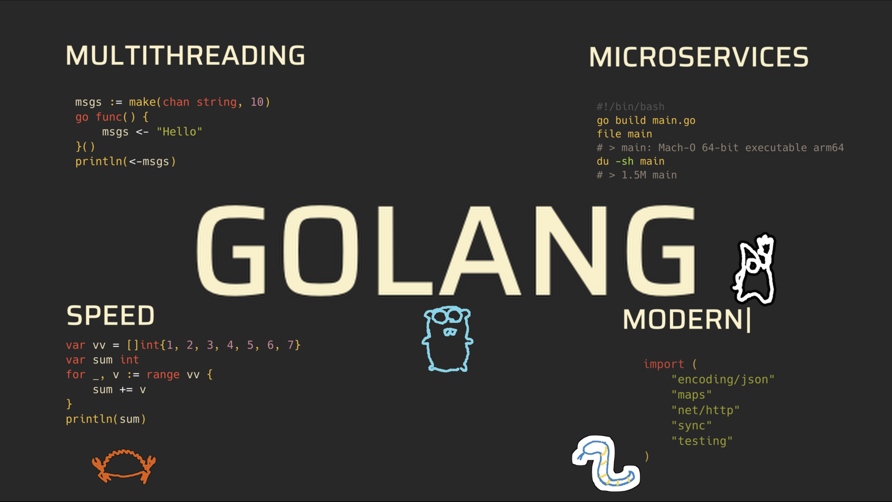

# Backend на Golang

Быстрый и наполненный курс про бэкенд-разработку на языке `go`.
На первых занятиях будет краткое введение в `go`,
после этого студентам расскажут о `HTTP`, веб-разработке, СУБД и разворачивании своего кода через `docker` и `docker compose`.

Канал курса в [Телеграм](https://t.me/itam_go_course).

## План

| № | Дата | Тема | Содержание |
|---|---|---|---|
| 1 | 28.09.26 | Golang 1 | Переменные, функции, массивы, мапы |
| 2 | 29.09.26 | Golang 2 | Структуры, интерфейсы |
| 3 | 05.10.26 | WEB 1 | HTTP, REST API, HTTP client, фреймворк go-echo |
| 4 | 06.10.26 | WEB 2 | go-echo middleware, go-echo validators |
| 5 | 12.10.26 | БД 1 | Postgres: Create, Insert, Select, Update, Delete |
| 6 | 13.10.26 | БД 2 | PGX, SQL-шаблоны, чуть-чуть про миграции |
| 7 | 19.10.26 | Deploy 1 | Аренда VPS, командная строка Linux, поднятие бэкенда |
| 8 | 20.10.26 | Deploy 2 | Docker + compose |
| 9 | 26.10.26 | Golang 3 | Горутины, мьютексы, каналы |
| 10 | 27.10.26 | Golang 4 | Атомики, семафоры, RWMutex |
| 11 | 02.11.26 | Системный дизайн 1 | Диаграммы, БТ vs ТЗ, функциональные и нефункциональные требования |
| 12 | 03.11.26 | Системный дизайн 2 | Распределённые транзакции как главная проблема распределённых систем (outbox, saga); реплики, шарды, партиции; монолиты и микросервисы |
| 13 | 09.11.26 | Кэш | Redis; политики вытеснения (LRU, LFU); инвалидация (TTL, по событию); стратегии кэширования (cache-aside, read-through, write-through, write-behind) |
| 14 | 10.11.26 | Очередь | Queue vs Stream |
| 15 | 16.11.26 | Observability 1 | Grafana, Prometheus |
| 16 | 17.11.26 | Observability 2 | VictoriaMetrics, Alerts |

## Обратная связь

По всем вопросам и предложениям пишите в тг: [@teadove](https://t.me/teadove)
